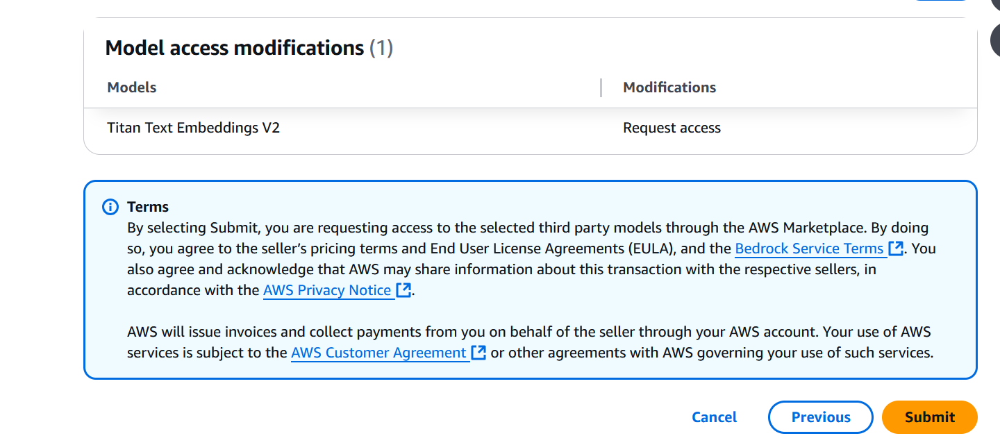

## Using Amazon OpenSearch ML Commons REST API

** this is repo is intended for demo purposes ONLY. For production workloads, make sure you follow security best practices such as creating resources within a VPCs, ensuring that IAM policies/roles have granular access control, etc. Resources should be deleted after done playing with various queries.

## Introduction
When ingesting data in to Amazon OpenSearch, customers often need to perform augmentation of that
data before putting in to their indexes. For instance, you might be ingesting log files with IP address and
want to get a geographic location for the IP address, or you might be ingesting customer comments and
want to identify the language they are in. This often requires an external process that complicates data
ingest pipelines and can cause data the pipeline to fail. Since OpenSearch 2.15 users can now call
external REST based services as part of their OpenSearch ingestion pipeline allowing the data
augmentation to be part of the ingestion process instead of an external step. This is a new feature of
the Machine Learning (ML) Commons plugin.

Our notebook will walk you through using an external REST API that will do language identification and add the language to the index
as part of the ingestion process using Amazon Comprehend.

The second part of our notebook will show you how to use the ML commons plugin to call an external REST
API to deploy the titan embeddings model v2 via Amazon Bedrock. We will use this embeddings model to perform multi-lingual
semantic vector search on a couple of documents.

## Prerequesites
To run the full demo, make sure you have an AWS Account with
access to:
1. Run a CloudFormation template
2. Create IAM roles and policies
3. Create a SageMaker Notebook
4. Create an OpenSearch cluster
5. Create an S3 bucket
6. Invoke Amazon Comprehend APIs
7. Invoke Amazon Bedrock Models

## Step 1. Request Titan Text Embeddings v2 model access
In your AWS Account, Go to the Bedrock Console. In the left hand menu, if you scroll down, you will see a section titled **Bedrock Configurations**. Click on **Model Access**

Click on the orange button that says **Modify model access** and enable access to the **Titan Text Embeddings V2** model

## Step 2. Run the Cloudformation template
Our template will create the Sagemaker notebook, the IAM roles/policies, Opensearch domain, and S3 bucket on your behalf. The rest of the demo will be run from the sagemaker notebook deployed. 
** It can take around 30 min for your stack to complete with all resources fully deployed

See [CONTRIBUTING](CONTRIBUTING.md#security-issue-notifications) for more information.

## License

This project is licensed under the Apache-2.0 License.

